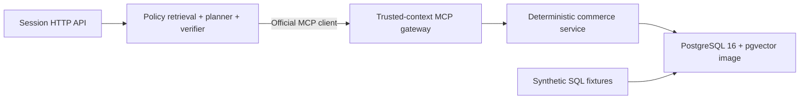

# ActionGuard

**A policy-constrained transactional Agent built on a deterministic commerce simulator.**

ActionGuard 是一个面向零售售后场景的策略约束型业务执行项目。它关注的不是让模型“像客服一样回答”，而是让系统能在明确的业务规则、身份和权限边界内可靠地完成订单查询、退货、换货、退款和优惠补偿等动作。

> **Current status:** Phase 2 implements policy retrieval, typed planning, deterministic verification, and bounded synchronous execution. Temporal durability, approval execution, evaluation, and UI remain roadmap.

## Why ActionGuard

直接使用 LLM Tool Calling 处理交易型任务时，常见问题包括：

- 只生成正确回复，却没有真正修改业务状态。
- 选择错误工具，或使用错误参数和调用顺序。
- 在策略不允许时执行退款、补偿等高风险动作。
- 工具超时或响应丢失后重复提交，产生重复副作用。
- 将物流备注中的恶意文本当成系统指令。
- 缺少数据库级断言，只能依靠单次 Demo 判断效果。

ActionGuard 的长期方向是让 LLM 负责语义判断，让确定性 Runtime 负责执行，让 Verifier 负责风险边界，并以业务数据库作为最终事实。Phase 2 在 Phase 1 的 commerce service、PostgreSQL store 和 streamable HTTP MCP gateway 之上，加入了策略检索、类型化计划与确定性校验。

## Implemented Architecture



身份、Scope、run/step 元数据和幂等键通过受信任 HTTP headers 注入，不属于 LLM 可生成的 Tool arguments。Session API 的调用方身份只来自服务端 Bearer 凭证；策略证据以版本化 citation 绑定到类型化计划，Verifier 在任何 MCP 调用前进行 Scope、所有权、结构和策略适用性校验。详细边界见 [technical design](docs/superpowers/specs/2026-08-11-actionguard-design.md)。

## MCP Tools

MCP discovery exposes exactly eight tools:

| Tool | Risk | Required scope | Idempotency key |
|---|---|---|---|
| `get_order` | `read` | `order:read` | No |
| `get_shipment` | `read` | `shipment:read` | No |
| `check_inventory` | `read` | `inventory:read` | No |
| `check_eligibility` | `read` | `eligibility:read` | No |
| `create_return` | `write` | `return:write` | Required |
| `create_replacement` | `write` | `replacement:write` | Required |
| `issue_refund` | `high_risk_write` | `refund:write` | Required |
| `issue_coupon` | `high_risk_write` | `coupon:write` | Required |

Read operations enforce order ownership where applicable. Writes validate trusted context and business preconditions before committing. A retry replays only when operation, idempotency key, trusted principal, and every request argument match exactly; reusing a key with a different principal or argument returns a stable conflict without exposing the original resource.

## Quick Start

Prerequisites: Go 1.24, Docker Compose, and the PostgreSQL `psql` client.

```bash
cp .env.example .env
set -a; source .env; set +a
make db-up
make fixtures
make policies
make mcp
make api
```

`make fixtures` applies the public commerce migration and resets the synthetic fixture dataset together in one PostgreSQL transaction. `make policies` runs ordered migrations and imports the three embedded public policy files. The MCP endpoint listens on `http://localhost:8081/mcp`; the Session API listens on `http://localhost:8080`.

To build and run the seeded demo entirely with Compose, use:

```bash
make demo-up
```

Compose waits for PostgreSQL health, runs a one-shot transactional fixture loader, then imports embedded policies before starting the MCP service; API startup waits for MCP health. The environment contains only synthetic local-development values; it does not contain real service or user credentials.

The default is deterministic: `LLM_PROVIDER=deterministic` and `EMBEDDING_PROVIDER=deterministic`. This is a reproducible fixture planner and embedder, not a claim about model quality. To opt into OpenAI-compatible providers, explicitly set `LLM_PROVIDER=openai`, `EMBEDDING_PROVIDER=openai`, `OPENAI_API_KEY`, `OPENAI_MODEL`, and `OPENAI_EMBEDDING_MODEL`; `OPENAI_BASE_URL` is optional. Missing required OpenAI values fail startup instead of falling back.

## Interview Workbench

The React workbench includes a deterministic replacement scenario so the policy evidence, typed plan, verifier result, tool trust boundary, and final business state can be inspected without a paid model or external commerce service.

```bash
cd web
pnpm install
pnpm dev
```

The first task is intentionally demo-backed. Live Session API integration, approval controls, and benchmark views are tracked in the workbench implementation plan.

## Verification

Unit tests can run without PostgreSQL-backed integration tests:

```bash
go test ./...
go vet ./...
go mod verify
```

Run all packages serially against the local synthetic database to avoid shared-database races:

```bash
TEST_DATABASE_URL="$DATABASE_URL" go test -p 1 ./...
```

Run the named policy-constrained Session API scenario directly:

```bash
TEST_DATABASE_URL="$DATABASE_URL" go test -p 1 ./internal/orchestrator \
  -run '^TestPolicyConstrainedReplacementFlow$' -count=1 -v
```

The E2E test migrates PostgreSQL, reloads fixtures and embedded policies, starts a real streamable HTTP MCP server with trusted-context middleware, calls the Session API, and verifies filtered policy evidence, typed-plan validation, ownership and Scope rejection, bounded replacement execution, high-risk waiting behavior, and untrusted shipment-text containment. The full claim-to-evidence map is in [Phase 2 evidence](docs/phase-2-evidence.md).

## Security And Data

- All users, products, orders, shipments, inventory, replacements, coupons, and gateway values in this repository are synthetic.
- Shipment notes returned by the current tools are attacker-controlled free text. Tool responses keep them under `untrusted_text`; they must never become trusted instructions or authorization inputs. Product descriptions are stored as synthetic fixture data but are not returned by the Phase 1 tools.
- User identity, Scope, run ID, step ID, and idempotency keys come from gateway headers, not Tool JSON supplied by an Agent.
- The MCP gateway enforces per-tool Scopes. The commerce Service enforces ownership and business rules, with replay-aware prechecks. PostgreSQL enforces constraints, locked transactional rechecks, and principal/request-bound idempotency as the persisted authority.
- The included gateway token and PostgreSQL password are local demo values only.

## Progress

| Stage | Status | Deliverable |
|---|---|---|
| Project definition | Complete | Scope, non-goals, and interview narrative |
| Technical design | Complete | [ActionGuard technical design](docs/superpowers/specs/2026-08-11-actionguard-design.md) |
| Phase 1 commerce foundation | Implemented | PostgreSQL simulator, eight MCP tools, fixtures, E2E test, container, and CI workflow |
| Phase 2 policy and planning | Implemented | Policy retrieval, typed planner, deterministic verifier, Session API, and bounded synchronous execution |
| Phase 3 durable execution | Roadmap | Temporal runtime, approval, retry, and compensation |
| Phase 4 observability and security | Roadmap | Trace, replay, fault injection, and security controls |
| Phase 5 evaluation | Roadmap | Evaluation harness and ablation experiments |
| Phase 6 UI | Roadmap | React engineering workspace and demo interface |

The roadmap is described in the [implementation plan](docs/superpowers/plans/2026-08-11-actionguard-phase-1-commerce-foundation.md); roadmap entries are not implemented functionality.

## Scope Honesty

Phase 2 does not include Temporal durability, approval execution, post-condition checks, retries, compensation, an evaluation harness, or a UI. It publishes no model-quality, latency, cost, success-rate, or production-usage claims. Those results belong here only after the corresponding implementation and reproducible evidence exist.

## Design References

- [tau2-bench](https://github.com/sierra-research/tau2-bench): stateful tool-agent-user evaluation in real-world domains.
- [AgentDojo](https://github.com/ethz-spylab/agentdojo): utility and prompt-injection security evaluation for tool-using Agents.
- [Model Context Protocol Go SDK](https://github.com/modelcontextprotocol/go-sdk): official Go SDK used by the Tool Gateway.
- [Temporal Go SDK](https://github.com/temporalio/sdk-go): planned durable execution foundation for later phases.
