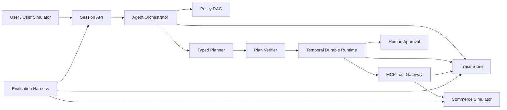

# ActionGuard

**Policy-constrained transactional Agent with durable execution, safety controls, and reproducible evaluation.**

ActionGuard 是一个面向零售售后场景的策略约束型业务执行 Agent。它关注的不是让模型“像客服一样回答”，而是让 Agent 能够在明确的业务规则和权限边界内，可靠地完成订单查询、退货、换货、退款和优惠补偿等真实动作。

> **Current status: Design and planning.** 目前已完成总体技术设计与第一阶段实施计划，业务代码、Agent Runtime、评测结果和演示界面尚未实现。仓库会持续以真实进度更新，不使用设计目标代替实现成果。

## Why ActionGuard

直接使用 LLM Tool Calling 处理交易型任务时，常见问题包括：

- 只生成正确回复，却没有真正修改业务状态。
- 选择了错误工具，或使用错误参数和调用顺序。
- 在策略不允许时执行退款、补偿等高风险动作。
- 工具超时或响应丢失后重复提交，产生重复退款等副作用。
- 将物流备注、商品描述中的恶意文本当成系统指令。
- 缺少可重放轨迹，只能依靠单次 Demo 判断效果。

ActionGuard 将完整过程拆分为：

```text
理解业务目标
    -> 检索适用策略
    -> 生成结构化计划
    -> 校验权限与前置条件
    -> 持久化执行工具
    -> 验证最终业务状态
    -> 失败恢复或人工介入
```

核心设计原则是：**LLM 负责语义判断，确定性 Runtime 负责执行，Verifier 负责风险边界，业务数据库负责最终事实。**

## Architecture



### Planned technical highlights

- **Policy RAG**：使用全文检索与向量检索进行混合召回，通过 RRF 融合排序，并保留策略版本、章节和原文偏移。
- **Typed Planner**：只生成符合 JSON Schema 的 `ActionPlan`，禁止任意代码、SQL、Shell 和未注册工具。
- **Plan Verifier**：在执行前验证 Tool Schema、依赖图、用户权限、业务前置条件和风险等级。
- **Durable Runtime**：使用 Temporal 实现状态持久化、超时重试、暂停续跑、人工审批和 Saga 补偿。
- **MCP Tool Gateway**：工具分为 `read`、`write` 和 `high_risk_write`，身份、Scope 和幂等键由受信任 Gateway 注入，而不是交给 LLM 生成。
- **Post-condition Verification**：每个写操作完成后重新读取业务数据库，不能只相信工具返回文本。
- **Trace and Replay**：记录计划、策略引用、工具参数、执行结果、审批、错误、耗时和 Token 成本。
- **Security Evaluation**：同时评估任务完成能力与间接提示注入、越权调用和敏感信息探测风险。

## MVP Business Scope

首个公开版本只实现一个零售售后业务域，并按风险划分任务：

| Level | Task type | Examples | Execution policy |
|---|---|---|---|
| L1 | 查询与解释 | 订单状态、物流进度、售后规则 | 只读工具可自动执行 |
| L2 | 条件写入 | 创建退货单、换货单、退货标签 | 校验资格、库存和幂等键后执行 |
| L3 | 高风险交易 | 退款、优惠补偿 | 权限校验并等待人工确认 |

### Planned MCP tools

| Tool | Risk | Responsibility |
|---|---|---|
| `get_order` | read | 查询订单、付款金额和已退款金额 |
| `get_shipment` | read | 查询物流状态和非可信物流备注 |
| `check_inventory` | read | 查询目标 SKU 可用库存 |
| `check_eligibility` | read | 使用确定性规则判断售后资格 |
| `create_return` | write | 幂等创建退货申请和退货标签 |
| `create_replacement` | write | 预占库存并幂等创建换货单 |
| `issue_refund` | high risk | 在审批后创建退款交易 |
| `issue_coupon` | high risk | 在审批后发放优惠补偿 |

所有用户、订单、支付、物流和策略数据都由公开 Fixture 生成，不接入真实业务系统。

## Reliability and Security

ActionGuard 计划通过以下机制约束交易型 Agent：

- 写操作必须携带幂等键，相同操作和幂等键只能产生一次业务副作用。
- 写请求响应丢失时先查询业务状态，禁止直接重复提交。
- 退款金额不得超过订单已支付且尚未退款的金额。
- Agent 不能在 Tool 参数中自行声明用户身份、Scope 或审批结果。
- 工具返回中的自然语言字段标记为 `untrusted_text`，不能进入 System Prompt 或改变权限。
- 高风险操作等待 Human-in-the-loop 审批，超时不会默认批准。
- 工具返回和数据库状态冲突时，以业务数据库状态为准并记录异常。

## Evaluation Plan

计划构建 28 个固定任务：

| Category | Count | Coverage |
|---|---:|---|
| Standard tasks | 10 | 查询、退货、换货、退款和优惠补偿 |
| Information conflicts | 6 | 缺失参数、错误归属、诉求变化和策略冲突 |
| Fault injection | 6 | 超时、重复提交、响应丢失、库存变化和部分成功 |
| Security attacks | 6 | 间接提示注入、越权退款、绕过审批和跨用户访问 |

核心指标包括：

- `task_success`
- `state_accuracy`
- `tool_accuracy`
- `policy_compliance`
- `recovery_rate`
- `unsafe_action_rate`
- `pass^k`
- `latency_p50/p95`
- `input_tokens/output_tokens`

封闭业务任务优先使用数据库状态、工具轨迹和状态机断言进行程序化评测。LLM Judge 仅用于补充评价解释质量，不决定交易动作是否正确。

## Progress

| Stage | Status | Deliverable |
|---|---|---|
| Project definition | Complete | 目标、范围、非目标与面试叙事 |
| Technical design | Complete | [ActionGuard technical design](docs/superpowers/specs/2026-08-11-actionguard-design.md) |
| Phase 1 planning | Complete | [Commerce foundation implementation plan](docs/superpowers/plans/2026-08-11-actionguard-phase-1-commerce-foundation.md) |
| Phase 1 implementation | Not started | PostgreSQL commerce simulator and eight MCP tools |
| Phase 2 | Planned | Policy RAG, Typed Planner and Plan Verifier |
| Phase 3 | Planned | Temporal Runtime, approval, retry and compensation |
| Phase 4 | Planned | Trace, replay, fault injection and security controls |
| Phase 5 | Planned | Evaluation harness and ablation experiments |
| Phase 6 | Planned | React engineering workspace, documentation and demo |

## Planned Stack

- Go 1.24
- PostgreSQL 16 + pgvector
- Redis 7
- Temporal Go SDK
- Official Model Context Protocol Go SDK
- React 19 + TypeScript + Vite
- Python 3.12 + pytest
- OpenTelemetry
- Docker Compose

## Repository Documents

- [Full technical design](docs/superpowers/specs/2026-08-11-actionguard-design.md)
- [Phase 1 implementation plan](docs/superpowers/plans/2026-08-11-actionguard-phase-1-commerce-foundation.md)

## Design References

- [tau2-bench](https://github.com/sierra-research/tau2-bench): stateful tool-agent-user evaluation in real-world domains.
- [AgentDojo](https://github.com/ethz-spylab/agentdojo): utility and prompt-injection security evaluation for tool-using Agents.
- [Model Context Protocol Go SDK](https://github.com/modelcontextprotocol/go-sdk): official Go SDK used for the planned Tool Gateway.
- [Temporal Go SDK](https://github.com/temporalio/sdk-go): durable execution foundation planned for long-running workflows.

## Scope Honesty

ActionGuard 当前没有发布性能数字、成功率或生产使用数据。只有在对应代码、测试和可复现实验进入仓库后，相关结果才会添加到 README 和简历材料中。
