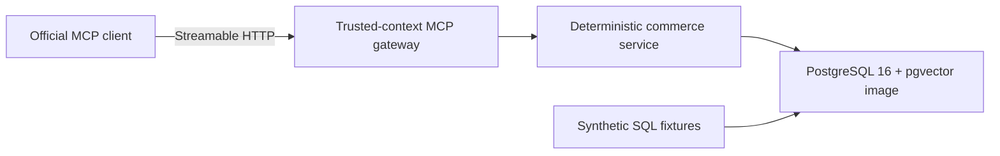

# ActionGuard

**A policy-constrained transactional Agent built on a deterministic commerce simulator.**

ActionGuard 是一个面向零售售后场景的策略约束型业务执行项目。它关注的不是让模型“像客服一样回答”，而是让系统能在明确的业务规则、身份和权限边界内可靠地完成订单查询、退货、换货、退款和优惠补偿等动作。

> **Current status:** Phase 1 implements the simulator and MCP tool layer; LLM orchestration is not implemented yet.

## Why ActionGuard

直接使用 LLM Tool Calling 处理交易型任务时，常见问题包括：

- 只生成正确回复，却没有真正修改业务状态。
- 选择错误工具，或使用错误参数和调用顺序。
- 在策略不允许时执行退款、补偿等高风险动作。
- 工具超时或响应丢失后重复提交，产生重复副作用。
- 将物流备注、商品描述中的恶意文本当成系统指令。
- 缺少数据库级断言，只能依靠单次 Demo 判断效果。

ActionGuard 的长期方向是让 LLM 负责语义判断，让确定性 Runtime 负责执行，让 Verifier 负责风险边界，并以业务数据库作为最终事实。Phase 1 先固定最底层的可执行合同：确定性 commerce service、PostgreSQL store 和 streamable HTTP MCP gateway。

## Implemented Architecture



身份、Scope、run/step 元数据和幂等键通过受信任 HTTP headers 注入，不属于 LLM 可生成的 Tool arguments。详细边界和后续架构见 [technical design](docs/superpowers/specs/2026-08-11-actionguard-design.md)，当前 Phase 1 的验收步骤见 [commerce foundation implementation plan](docs/superpowers/plans/2026-08-11-actionguard-phase-1-commerce-foundation.md)。

## MCP Tools

MCP discovery exposes exactly eight tools:

| Tool | Risk | Required scope | Idempotency key |
|---|---|---|---|
| `get_order` | `read` | `order:read` | No |
| `get_shipment` | `read` | `shipment:read` | No |
| `check_inventory` | `read` | `inventory:read` | No |
| `check_eligibility` | `read` | `eligibility:read` | No |
| `create_return` | `write` | `return:write` | Required |
| `create_replacement` | `write` | `replacement:write` | Required |
| `issue_refund` | `high_risk_write` | `refund:write` | Required |
| `issue_coupon` | `high_risk_write` | `coupon:write` | Required |

Read operations enforce order ownership where applicable. Writes validate trusted context and business preconditions before committing, and retries with the same operation and idempotency key return the original resource without duplicating the side effect.

## Quick Start

Prerequisites: Go 1.24, Docker Compose, and the PostgreSQL `psql` client.

```bash
cp .env.example .env
set -a; source .env; set +a
make db-up
make fixtures
make mcp
```

`make fixtures` applies the public commerce migration and resets the synthetic fixture dataset together in one PostgreSQL transaction, so it works against a fresh database and remains safe to repeat. The MCP endpoint listens on `http://localhost:8081/mcp`.

To build and run the seeded demo entirely with Compose, use:

```bash
make demo-up
```

Compose waits for PostgreSQL health, runs a one-shot transactional fixture loader, and starts the MCP service only after loading succeeds. The environment contains only synthetic local-development values; it does not contain real service or user credentials.

## Verification

Unit tests can run without PostgreSQL-backed integration tests:

```bash
go test ./...
go vet ./...
go mod verify
```

Run all packages serially against the local synthetic database to avoid shared-database races:

```bash
TEST_DATABASE_URL="$DATABASE_URL" go test -p 1 ./...
```

Run the named streamable HTTP MCP scenario directly:

```bash
TEST_DATABASE_URL="$DATABASE_URL" go test -p 1 ./internal/mcpserver \
  -run '^TestDamagedItemReplacementAndCouponFlow$' -count=1 -v
```

The E2E test migrates PostgreSQL, reloads fixtures, starts a real `httptest` MCP server, uses the official MCP client, and verifies replacement/coupon side effects, idempotent replay, inventory reservation, missing-Scope rejection, cross-user rejection, exact tool discovery, and untrusted shipment-text containment.

## Security And Data

- All users, products, orders, shipments, inventory, replacements, coupons, and gateway values in this repository are synthetic.
- Product descriptions and shipment notes are attacker-controlled free text. Tool responses keep such values under `untrusted_text`; they must never become trusted instructions or authorization inputs.
- User identity, Scope, run ID, step ID, and idempotency keys come from gateway headers, not Tool JSON supplied by an Agent.
- The commerce service enforces ownership and authorization before writes. PostgreSQL constraints, transactions, and operation-scoped idempotency records protect persisted state and repeated requests.
- The included gateway token and PostgreSQL password are local demo values only.

## Progress

| Stage | Status | Deliverable |
|---|---|---|
| Project definition | Complete | Scope, non-goals, and interview narrative |
| Technical design | Complete | [ActionGuard technical design](docs/superpowers/specs/2026-08-11-actionguard-design.md) |
| Phase 1 commerce foundation | Implemented | PostgreSQL simulator, eight MCP tools, fixtures, E2E test, container, and CI workflow |
| Phase 2 policy and planning | Roadmap | Policy RAG, Typed Planner, and Plan Verifier |
| Phase 3 durable execution | Roadmap | Temporal runtime, approval, retry, and compensation |
| Phase 4 observability and security | Roadmap | Trace, replay, fault injection, and security controls |
| Phase 5 evaluation | Roadmap | Evaluation harness and ablation experiments |
| Phase 6 UI | Roadmap | React engineering workspace and demo interface |

The roadmap is described in the [implementation plan](docs/superpowers/plans/2026-08-11-actionguard-phase-1-commerce-foundation.md); roadmap entries are not implemented functionality.

## Scope Honesty

ActionGuard does not yet include LLM orchestration, Policy RAG, a Typed Planner, a Plan Verifier, Temporal workflows, an evaluation harness, or a UI. It publishes no performance, success-rate, or production-usage claims. Those results belong here only after the corresponding implementation and reproducible evidence exist.

## Design References

- [tau2-bench](https://github.com/sierra-research/tau2-bench): stateful tool-agent-user evaluation in real-world domains.
- [AgentDojo](https://github.com/ethz-spylab/agentdojo): utility and prompt-injection security evaluation for tool-using Agents.
- [Model Context Protocol Go SDK](https://github.com/modelcontextprotocol/go-sdk): official Go SDK used by the Tool Gateway.
- [Temporal Go SDK](https://github.com/temporalio/sdk-go): planned durable execution foundation for later phases.
