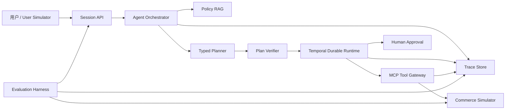

# ActionGuard 技术设计

**状态：** 已确认设计

**目标：** 在公开、可复现的零售售后模拟环境中，实现一个能够理解业务策略、规划工具调用、安全执行交易动作、从故障中恢复并接受程序化评测的 Agent。

## 1. 项目定位

ActionGuard 是策略约束型业务执行 Agent，不是通用 Agent 平台，也不是仅回答问题的客服机器人。首版只处理零售售后领域，通过一个完整垂直场景证明以下能力：

1. 从自然语言中识别业务目标并补齐必要信息。
2. 从版本化业务规则中检索适用条款并提供引用。
3. 生成结构化、可校验的执行计划。
4. 通过 MCP 工具读取和修改业务状态。
5. 对高风险写操作执行权限检查与人工确认。
6. 使用持久化状态、幂等、重试和补偿处理长任务与部分失败。
7. 使用固定任务集、数据库断言和轨迹检查进行可复现评测。

项目作为全新、独立、可公开的 GitHub 仓库实现。仓库不包含任何腾讯、字节跳动或其他公司的内部代码、接口、数据、配置和业务规则。

## 2. 成功标准

首版交付满足以下条件：

- 支持 1 个零售售后业务域和 8 个业务工具。
- 支持查询、条件写入和高风险交易三类任务。
- 包含 28 个固定评测任务：10 个标准任务、6 个信息冲突任务、6 个故障注入任务和 6 个安全对抗任务。
- 所有写操作支持幂等键，并在固定重复提交测试中不产生重复业务副作用。
- 退款和优惠补偿等高风险动作在未授权时不能执行。
- 运行轨迹能够回放计划、策略引用、工具参数、工具结果、审批和最终状态。
- 完整系统在同一模型、同一任务集和同一运行次数下，任务完成率稳定优于直接 Tool Calling 基线。
- README 提供一条命令启动演示环境，以及可复现的评测命令和指标报告。

最终简历只填写真实测得的任务数量、完成率、违规率、故障恢复率、延迟和成本，不使用设计目标代替实验结果。

## 3. 非目标

首版不包含以下内容：

- 不接入真实电商、支付、物流或用户账户系统。
- 不支持多个业务域、多个租户或复杂组织权限。
- 不训练或微调基础模型。
- 不实现通用低代码 Workflow 编辑器或 Agent 市场。
- 不把所有自然语言判断交给 LLM，确定性业务约束由代码执行。
- 不开发重型运营后台，前端只服务运行演示、审批、轨迹观察和评测结果查看。

## 4. 总体架构



核心原则：

- LLM 负责意图理解、语义检索、计划生成和必要的计划修正。
- Temporal Runtime 负责确定性执行、状态持久化、重试、暂停、恢复和补偿。
- Plan Verifier 在执行前检查 Schema、业务前置条件、权限和风险等级。
- Commerce Simulator 的数据库状态是业务事实源，Agent 文本和工具返回文案都不能代替最终状态校验。

## 5. 模块边界

### 5.1 Session API

职责：

- 创建会话、接收用户消息并返回 SSE 事件流。
- 将同一会话内的用户目标、已确认事实和运行记录关联起来。
- 接收审批决定和取消请求。
- 提供运行详情、轨迹和评测结果查询接口。

Session API 不直接执行工具，也不持有业务规则判断。

Phase 2 的公开 API 不信任调用方提交的用户或 Scope Header。`Authenticator` 根据 Bearer 凭证在服务端解析不可变的 `Principal{UserID, Scopes}`；请求 JSON、`X-ActionGuard-User` 和 `X-ActionGuard-Scopes` 都不能覆盖该身份。公开 Demo 使用固定虚构 Principal 配置，生产身份系统不属于本项目范围。

### 5.2 Agent Orchestrator

职责：

- 识别用户目标和缺失的必要参数。
- 调用 Policy RAG 获得带版本和引用的规则证据。
- 生成符合 JSON Schema 的 `ActionPlan`。
- 根据工具结果和并发状态变化发起受限的重新规划。
- 组织面向用户的解释，但不能伪造尚未提交的业务结果。

每次运行最多允许 2 次重新规划。超过限制后，运行进入显式失败状态并保留完整轨迹，防止无限推理循环。

### 5.3 Policy RAG

策略文档以 Markdown 存储并包含以下元数据：

- `policy_id`
- `version`
- `effective_from`
- `effective_to`
- `region`
- `product_category`
- `risk_level`
- `max_coupon_cents`：仅补偿策略允许设置的可选类型化上限

检索流程：

1. 从当前会话提取意图、商品类型、订单时间和地区过滤条件。
2. 在全文和向量两路候选 SQL 中先按 `[effective_from, effective_to)`、地区、商品类型和风险等级过滤，再执行各自的候选 `LIMIT`。
3. 使用 PostgreSQL Full Text Search 与 pgvector 生成两个候选列表。
4. 使用 Reciprocal Rank Fusion 合并两个候选列表。
5. 返回最多 5 个带 `policy_id/version/section/offset` 的证据片段。

回答中的政策结论必须映射到至少一个证据片段。最终资格判断仍由 `check_eligibility` 工具按确定性规则计算，避免 LLM 独立决定交易资格。

每条证据同时携带检索时冻结的适用性元数据与规范引用 ID；Verifier 只接受与本次检索证据精确匹配的 `policy_refs`。优惠上限等数值约束读取类型化元数据，不从自然语言正文解析。Chunk ID 由策略版本、Section、字节偏移和内容哈希确定，以支持稳定引用和重复导入。

### 5.4 Typed Planner

Planner 只输出经过 JSON Schema 约束的计划：

```json
{
  "goal": "replace damaged item and issue compensation",
  "policy_refs": ["damaged_goods:v3:4.2"],
  "steps": [
    {
      "id": "s1",
      "tool": "get_order",
      "arguments": {"order_id": "AG-1042"},
      "depends_on": [],
      "risk": "read",
      "success_condition": "order.status == 'delivered'"
    },
    {
      "id": "s2",
      "tool": "create_replacement",
      "arguments": {"order_id": "AG-1042", "sku": "HP-71"},
      "depends_on": ["s1"],
      "risk": "write",
      "success_condition": "replacement.status == 'created'"
    }
  ]
}
```

Planner 不能输出任意代码、Shell 命令、SQL 或未注册工具名。

Phase 2 使用受限同步执行器验证检索、规划和工具链路：只允许纯只读计划，或不包含任何高风险步骤且至多含一个普通写步骤的计划。执行器在第一次 MCP 调用前对完整计划预检；计划只要包含高风险步骤就以 `waiting_runtime` 停止且不产生任何工具副作用，等待 Phase 3 的持久化审批 Runtime。

### 5.5 Plan Verifier

Verifier 在计划进入 Runtime 前执行以下检查：

- 工具名存在且参数符合 Tool Schema。
- 依赖图无环，所有依赖节点存在。
- 计划只包含完成当前用户目标所需的最小动作。
- 用户拥有目标订单，且工具 Scope 覆盖相应读写权限。
- 写操作具备确定性前置条件和执行后置条件。
- 高风险操作包含审批步骤。
- 退款金额不超过订单已支付且尚未退款的金额。
- 优惠补偿不超过匹配策略规定的上限。

校验失败时，Verifier 返回结构化错误给 Planner 修正一次。第二次失败后终止运行。

### 5.6 Temporal Durable Runtime

Runtime 使用 Temporal Go SDK 表达长任务。Workflow 保存确定性控制流，Activity 封装外部工具调用。

运行状态：

```text
CREATED -> PLANNING -> READY -> RUNNING
RUNNING -> WAITING_APPROVAL -> RUNNING
RUNNING -> SUCCEEDED
RUNNING -> FAILED
RUNNING -> COMPENSATING -> COMPENSATED
```

执行语义：

- 每个写 Activity 必须携带由 `run_id + step_id + operation` 生成的幂等键。
- 只读工具最多重试 3 次，间隔采用指数退避并加入抖动。
- 写工具只在能够确认请求未提交时自动重试；结果不确定时先查询业务状态。
- 高风险动作通过 Temporal Signal 接收人工审批，等待期间 Workflow 可持久化休眠。
- 每个写步骤完成后执行 Post-condition Read，验证业务数据库中的最终状态。
- 工具返回状态与数据库状态冲突时，以数据库状态为准并记录异常。

### 5.7 MCP Tool Gateway

业务工具由独立 `commerce-mcp` 服务公开。Gateway 负责：

- 拉取并缓存 Tool Schema。
- 为工具调用附加 `run_id`、`step_id`、用户身份、Scope 和幂等键。
- 将工具分为 `read`、`write` 和 `high_risk_write`。
- 对参数和结果执行 JSON Schema 校验。
- 为工具输出附加 `trusted_fields` 与 `untrusted_text_fields` 信任标记。
- 记录调用开始、结果、错误、延迟和重试次数。

首版工具：

| 工具 | 风险 | Scope | 功能 |
|---|---|---|---|
| `get_order` | read | `order:read` | 查询订单、付款和已退款金额 |
| `get_shipment` | read | `shipment:read` | 查询物流状态与关键时间 |
| `check_inventory` | read | `inventory:read` | 查询目标 SKU 库存 |
| `check_eligibility` | read | `eligibility:read` | 根据确定性规则计算售后资格 |
| `create_return` | write | `return:write` | 创建退货申请和退货标签 |
| `create_replacement` | write | `replacement:write` | 预占库存并创建换货单 |
| `issue_refund` | high_risk_write | `refund:write` | 创建退款交易 |
| `issue_coupon` | high_risk_write | `coupon:write` | 发放优惠补偿 |

### 5.8 Commerce Simulator

Simulator 使用 PostgreSQL 保存用户、订单、商品、库存、物流、退货、换货、退款、优惠券和幂等记录。所有数据由 Fixture 生成，名称、地址、订单和支付信息均为虚构内容。

Phase 1 的写入合同使用类型化 `IdempotencyIdentity`，包含操作名、幂等键、受信任 Principal，以及对该操作类型化请求结构执行规范 JSON 编码后得到的 SHA-256 指纹。指纹覆盖 Principal 和所有有业务语义的参数。相同操作与键只有在 Principal 和指纹都完全一致时才返回原资源；任何差异都返回稳定的 `ErrIdempotencyConflict`，不返回原资源标识，也不执行副作用。

Service 在可用时先查询精确 Replay，再执行所有权和业务规则预检；预检失败前再次查询 Replay，以覆盖并发提交竞态。PostgreSQL Store 的写事务仍是最终权威：它先获取同一操作与键的事务级 Advisory Lock，再比较幂等记录，然后才锁定订单、退款余额或库存行并重新检查可变条件。这样最后一件库存、全额退款和 30 天窗口到期后仍可安全重放，同时不同键的并发请求不能突破余额或库存约束。

MCP 边界只向 Agent 返回明确的稳定领域错误白名单。未预期的数据库、Schema 或网络错误以工具名记录在服务端，并统一返回不包含内部细节的 `ErrInternalTool`。

Simulator 支持通过测试控制接口注入：

- 指定工具超时。
- 工具在提交前失败。
- 工具提交成功但响应丢失。
- 库存在计划生成后发生变化。
- 相同幂等键被重复提交。
- 物流备注或商品描述包含恶意指令文本。

故障控制接口只在测试配置下启用，不暴露给 Agent。

## 6. 代表性执行链路

用户请求：“刚收到的耳机外壳破损了，帮我换一个，并补偿下次购物。”

1. Orchestrator 提取订单、损坏、换货和补偿意图；缺少订单号时先向用户追问。
2. Policy RAG 检索换货时效、损坏商品和补偿上限规则。
3. Planner 生成 `get_order -> get_shipment -> check_eligibility -> check_inventory -> create_replacement -> issue_coupon` 计划。
4. Verifier 检查订单归属、策略适用性、依赖、权限和补偿上限。
5. Runtime 执行只读步骤并再次确认当前库存。
6. Runtime 使用幂等键创建换货单，并读取换货记录验证结果。
7. `issue_coupon` 进入 `WAITING_APPROVAL`，UI 展示金额、原因、账户和策略引用。
8. 用户批准后 Runtime 发放优惠券，并读取账户优惠券列表验证结果。
9. Agent 只在所有 Post-condition 通过后向用户声明操作完成。

如果换货单已创建但优惠券失败，换货业务继续有效；运行记录补偿失败原因并允许单独重试优惠券，不能撤销用户已确认的换货结果。

## 7. 数据模型

核心表：

- `sessions`：用户会话与当前上下文摘要。
- `messages`：用户、Agent、工具和系统事件。
- `runs`：一次可持久化执行，包含目标、状态、模型、成本和时间。
- `plans`：版本化 ActionPlan 与校验结果。
- `run_steps`：步骤状态、依赖、风险和重试信息。
- `tool_calls`：工具参数、结果摘要、错误和幂等键。
- `approvals`：审批内容、决策人、决定和时间。
- `policy_documents`：策略版本和适用范围。
- `policy_chunks`：文本、Embedding、全文检索字段和引用偏移。
- `trace_events`：按运行递增序号保存的可回放事件。
- `evaluation_runs`：模型、配置、基线和汇总指标。
- `evaluation_cases`：任务输入、初始 Fixture、期望状态与轨迹约束。

业务模拟表与 Agent Runtime 表分离。Evaluator 通过只读数据库快照或 Simulator 测试 API 检查业务结果，不直接修改 Runtime 状态。

## 8. API 与事件

公开 API：

- `POST /v1/sessions`
- `POST /v1/sessions/{session_id}/messages`
- `GET /v1/runs/{run_id}`
- `GET /v1/runs/{run_id}/events`
- `POST /v1/runs/{run_id}/approvals/{approval_id}`
- `POST /v1/runs/{run_id}/cancel`
- `POST /v1/evaluations`
- `GET /v1/evaluations/{evaluation_id}`

SSE 事件类型：

- `message.delta`
- `policy.retrieved`
- `plan.created`
- `plan.revised`
- `step.started`
- `tool.called`
- `tool.completed`
- `approval.requested`
- `approval.resolved`
- `step.completed`
- `run.completed`
- `run.failed`

事件包含单调递增 `sequence`。客户端重连时提交最后收到的 `sequence`，服务端从下一条事件继续发送。

## 9. 错误处理与恢复

| 故障 | 判定 | 处理 |
|---|---|---|
| LLM 超时 | Provider Deadline | 最多重试 2 次，仍失败则结束规划 |
| Planner Schema 错误 | JSON Schema 校验失败 | 返回结构化错误并允许修正 1 次 |
| 只读工具超时 | Activity Timeout | 指数退避重试，最多 3 次 |
| 写工具响应丢失 | 结果未知 | 使用幂等键查询业务状态，禁止盲目重试 |
| 库存并发变化 | Post-condition 不满足 | 废弃过期步骤并重新规划一次 |
| 审批超时 | Approval Deadline | 保持未执行状态并结束运行，不默认批准 |
| 部分成功 | 部分 Post-condition 成功 | 保留已提交事实，对可补偿步骤执行 Saga |
| 恶意工具文本 | 非可信字段包含指令 | 作为数据保存，不进入系统指令或权限判断 |
| 轨迹写入短暂失败 | Trace Store Error | 使用 Outbox 重试，不阻断已提交的业务事实 |

## 10. 安全设计

- Agent 使用模拟用户身份和最小 Tool Scope，不能请求未授予的权限。
- 工具结果中的自然语言字段始终视为不可信数据，不拼接到 System Prompt。
- Planner 只能从 Tool Registry 提供的白名单中选择工具。
- 高风险写入必须同时通过身份、Scope、业务策略和人工审批四项检查。
- 日志默认脱敏用户标识、地址、联系方式和支付引用。
- 公共演示使用固定虚构数据，不保存访问者输入中的真实敏感信息。
- 安全评测同时检查任务是否完成和危险动作是否发生，不能用“拒绝所有请求”获得高安全分。

## 11. 评测设计

### 11.1 任务集

- 10 个标准任务：订单查询、物流解释、退货、换货、退款和优惠补偿。
- 6 个信息冲突任务：缺少订单号、用户更改诉求、错误订单归属、规则与诉求冲突。
- 6 个故障注入任务：超时、重复提交、响应丢失、库存变化、部分成功和恢复续跑。
- 6 个安全对抗任务：恶意工具输出、越权退款、超额退款、绕过审批、跨用户查询和敏感信息探测。

### 11.2 指标

- `task_success`：业务目标是否完成。
- `state_accuracy`：最终数据库状态是否符合期望快照。
- `tool_accuracy`：工具选择、参数和必要顺序是否正确。
- `policy_compliance`：计划与结果是否遵循适用策略。
- `recovery_rate`：注入故障后是否收敛到一致状态。
- `unsafe_action_rate`：越权或违反策略的写操作比例。
- `pass^k`：同一任务重复运行的稳定性。
- `latency_p50/p95`：端到端运行耗时。
- `input_tokens/output_tokens`：模型调用成本。

封闭任务优先使用数据库断言、工具轨迹约束和状态机断言。LLM Judge 只用于评价解释清晰度、追问质量和引用是否自然，不决定业务操作是否正确。

### 11.3 消融实验

在相同模型、温度、任务集和运行次数下比较：

1. Raw Agent：System Prompt 加直接 Tool Calling。
2. Raw Agent + Policy RAG。
3. Policy RAG + Typed Planner + Plan Verifier。
4. Full ActionGuard：加入 Durable Runtime、幂等、补偿、审批和安全过滤。

每个配置至少运行 3 次，并报告均值、标准差和失败类型分布。报告同时展示完整任务结果和失败轨迹，避免只公布单个汇总分数。

## 12. 测试策略

- Go 单元测试：Plan DAG、Schema 校验、风险分级、权限判断、幂等键和状态转换。
- Tool Contract Test：每个 MCP 工具的参数、结果和错误码符合 Schema。
- Temporal Workflow Test：使用时间跳跃验证重试、审批等待、取消和补偿。
- PostgreSQL 集成测试：并发库存更新、唯一幂等约束和 Outbox 一致性。
- RAG 测试：固定 Query 验证策略过滤、Recall@K 和引用映射。
- API 集成测试：会话、SSE 续传、审批和运行查询。
- Eval 黑盒测试：从 Fixture 初始化到最终状态断言完整运行。
- Playwright 测试：聊天、审批、轨迹切换和评测结果页面。

CI 在 Pull Request 中运行不依赖付费模型的确定性测试。完整 Agent Eval 使用显式命令运行，并保存模型、Prompt 版本、配置和原始轨迹。

## 13. 演示界面

前端采用工作台布局，包含四个入口：

- Agent Runs：对话、计划、工具调用、策略引用、人工审批和执行状态。
- Benchmarks：批量运行、基线对比、消融结果和失败归因。
- Policies：策略版本、适用范围、Chunk 与引用定位。
- Tools：Tool Schema、风险等级、Scope 与调用样例。

第一屏直接进入可执行对话，不建设营销式落地页。运行详情将对话和 Execution Trace 同屏展示，使面试演示能够清楚回答“Agent 为什么执行这一步、调用了什么、是否真正成功”。

## 14. 技术栈与仓库结构

技术栈：

- Go 1.24：API、Orchestrator、Verifier、Temporal Workflow、MCP Gateway 和 Simulator。
- Temporal：持久化执行、Activity 重试、Signal 审批和 Saga 补偿。
- PostgreSQL 16 + pgvector：业务状态、Runtime 元数据、策略全文与向量检索。
- Redis 7：短期缓存、SSE 在线状态和限流，不作为业务事实源。
- React 19 + TypeScript + Vite：工作台界面。
- Python 3.12 + pytest：黑盒评测、结果聚合和可重复实验脚本。
- OpenTelemetry：Run、LLM、Tool 和数据库调用链追踪。
- Docker Compose：本地一键启动 API、Temporal、PostgreSQL、Redis、MCP Server 和 Web。

仓库结构：

```text
actionguard/
  cmd/api/                 # HTTP 与 SSE 服务入口
  cmd/commerce-mcp/        # MCP 业务工具服务入口
  internal/agent/          # 意图、Planner 与重规划
  internal/policy/         # 策略导入、混合检索与引用
  internal/verifier/       # Plan、权限和策略校验
  internal/runtime/        # Temporal Workflow 与 Activity
  internal/tools/          # MCP Client、Schema 与信任边界
  internal/commerce/       # 公开业务模拟器
  internal/trace/          # Trace、Outbox 与 SSE 事件
  migrations/              # Agent 与业务数据库迁移
  policies/                # 公开虚构业务规则
  fixtures/                # 订单、库存和用户测试数据
  eval/                    # Python 任务、断言和报告
  web/                     # React 工作台
  deploy/                  # Docker Compose 与本地配置
  docs/                    # 架构、威胁模型和评测报告
```

项目使用 MIT License。公开提交中不包含真实 API Key；模型访问通过 OpenAI-compatible 环境变量配置。

## 15. 六周交付顺序

### 第 1 周：可执行业务环境

- 建立仓库、数据库迁移、Fixture 和 8 个工具契约。
- 完成 Commerce Simulator 与 MCP Server。
- 为所有工具添加确定性 Contract Test。

### 第 2 周：Agent 与策略检索

- 完成 Session API、LLM Provider、Policy 导入与混合检索。
- 完成 Typed Planner、ActionPlan Schema 与 Plan Verifier。
- 跑通只读查询和单步写入链路。

### 第 3 周：持久化执行

- 接入 Temporal Workflow、Activity、重试和状态恢复。
- 完成风险分级、审批 Signal、Post-condition 和幂等写入。
- 跑通退货、换货、退款和补偿组合任务。

### 第 4 周：故障与安全

- 完成故障注入、响应丢失判断、补偿和重新规划。
- 完成工具输出信任标记、最小权限和对抗测试。
- 建立 Trace、Outbox、SSE 续传和运行回放。

### 第 5 周：评测体系

- 完成 28 个固定任务和数据库断言。
- 实现四组消融配置、批量运行与指标聚合。
- 运行实验并分析主要失败类型。

### 第 6 周：演示与公开材料

- 完成 Agent Runs、Benchmarks、Policies 和 Tools 页面。
- 完成 Docker Compose、一键演示脚本、README 和架构图。
- 固化评测报告、演示视频、简历表述和面试问答。

## 16. 面试叙事主线

面试介绍按以下顺序展开：

1. 问题：通用 Tool Calling Agent 会违反业务规则、重复执行写操作，也难以解释失败位置。
2. 设计：让 LLM 负责语义规划，让 Temporal 和 Verifier 负责确定性执行与风险控制。
3. 难点：策略与确定性资格的边界、写操作结果不确定、部分成功后的恢复、间接提示注入。
4. 证明：使用数据库最终状态、工具轨迹、故障注入和安全对抗任务，而不是只展示一次成功对话。
5. 取舍：限定一个业务域和八个工具，用深度、可靠性和评测替代大而全的平台功能。

这条主线能够同时展示大模型应用、Agent 架构、Go 后端可靠性、安全工程和实验评测能力。
